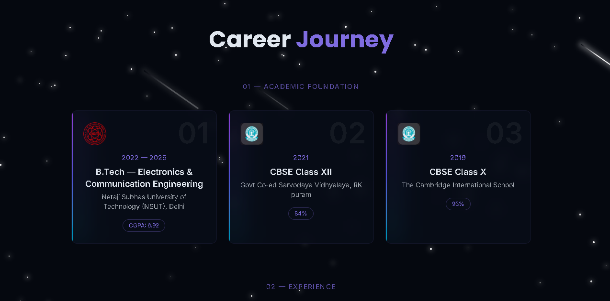
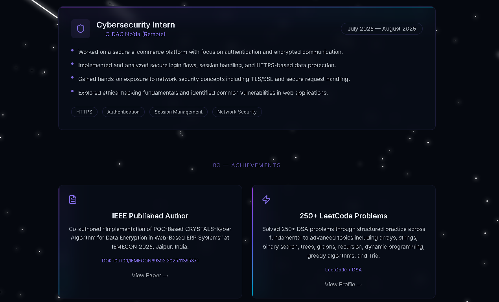

# 🌐 Personal Portfolio Website

## 🔗 Live Links

- 🚀 **Live Demo:** https://divya-portfolio-steel.vercel.app/
- 💻 **GitHub Repository:** https://github.com/bholadivya/divya-portfolio.git

---

## ✨ Overview

This is my personal portfolio website built to showcase my work, technical skills, and development journey as a **frontend-focused full stack developer**.

The portfolio is designed with a strong emphasis on **clean UI, smooth interactions, and performance**, creating a seamless and engaging user experience.

---

## 🚀 Features

- 🌌 **Dynamic UI Experience**  
  Animated star background, smooth transitions, and subtle micro-interactions

- 🧩 **Modular Architecture**  
  Reusable components for scalability and maintainability

- 📂 **Project Showcase**  
  Highlighted projects with live demos and GitHub links

- 🧠 **Interactive Skills Section**  
  Category-based filtering with real tech icons

- 🛤 **Career Journey Section**  
  Structured representation of experience, education, and achievements

- 📱 **Fully Responsive Design**  
  Optimized across all screen sizes

---

## 🧩 Tech Stack

**Frontend:**  
- React (Vite)  
- Tailwind CSS  

**Libraries & Tools:**  
- Lucide React  
- React Icons  
- clsx + tailwind-merge  

---

## 💡 Key Highlights

- Designed with a **minimal yet visually engaging UI**
- Implemented **custom animations and glowing UI effects**
- Built with **component-driven architecture**
- Focused on **performance, responsiveness, and clean code practices**

---

## 📸 Preview

<p align="center">
  
  
  
  
  
  
  
</p>

---

## ⚙️ Installation & Setup

```bash
git clone https://github.com/bholadivya/divya-portfolio.git
cd divya-portfolio
npm install
npm run dev
```

## 🌐 Deployment 

* Hosted on Vercel
* Optimized for fast loading and performance

---

## 🚀 Future Enhancements 

* Contact form with backend integration
* Blog section
* More interactive animations
* Performance optimizations

--- 

## 👨‍💻 Author 

**Divya Bhola** 

Frontend-Focused Full Stack Developer