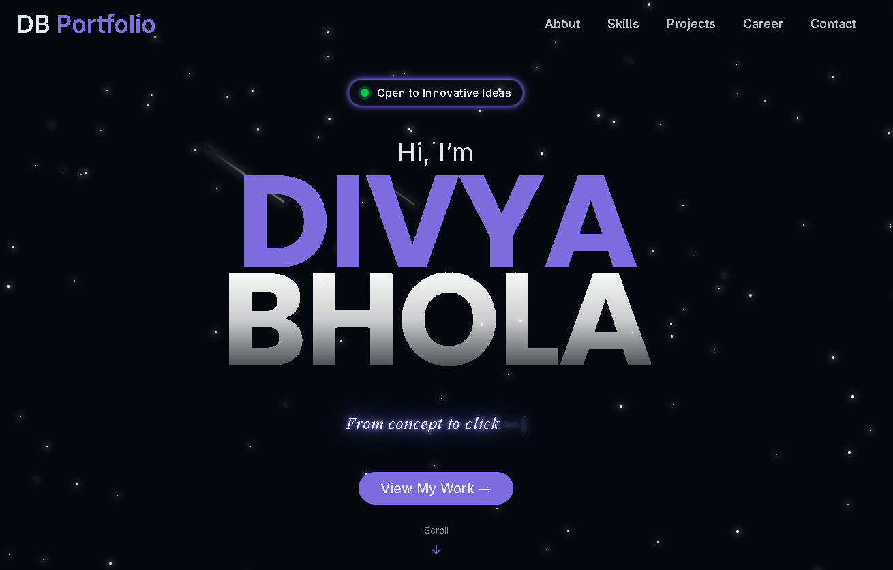
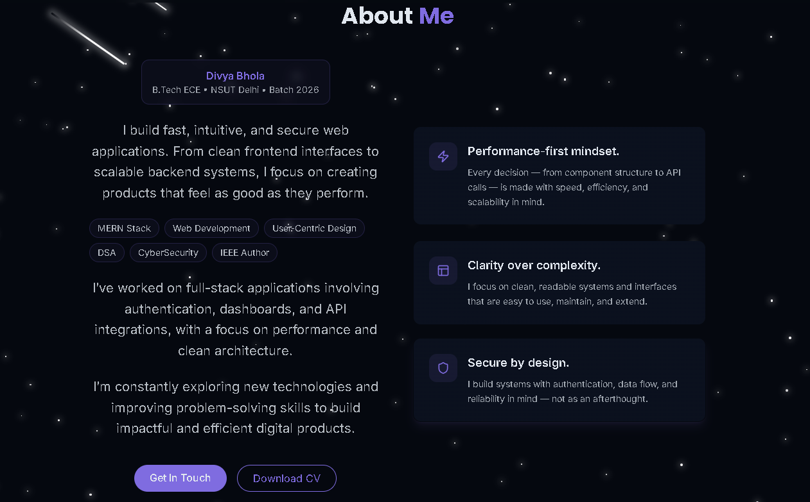
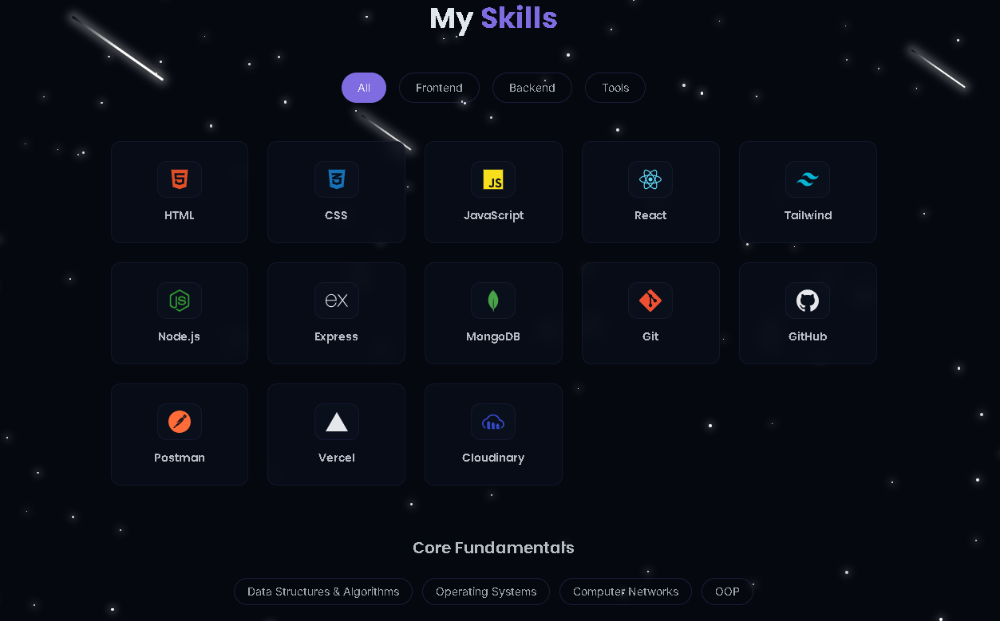
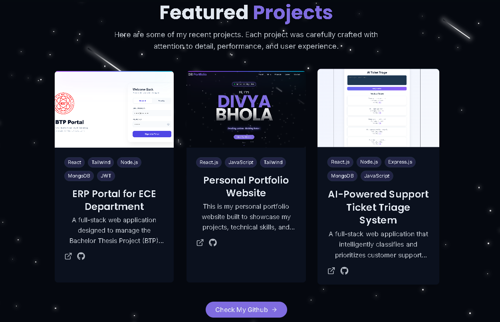
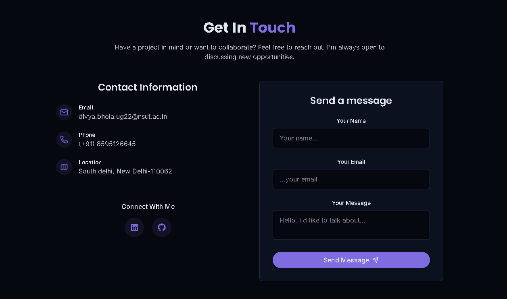

# 🌐 Personal Portfolio Website

## 🔗 Links

- 🌐 **Live Demo:** https://your-portfolio-link.vercel.app  
- 💻 **GitHub Repo:** https://github.com/bholadivya/divya-portfolio.git

---

## 📌 Overview

This is my personal portfolio website built to showcase my projects, technical skills, and development experience as a frontend-focused full stack developer.

The portfolio is designed with a focus on **clean UI, responsiveness, and user experience**, providing an interactive way to explore my work.

---

## 🚀 Features

- 🌙 Dark mode toggle  
- ✨ Animated UI (stars background, fade-in effects)  
- 📂 Project showcase  
- 🧠 Skills filtering system  
- 📬 Contact section for user interaction  
- 📱 Fully responsive design  
---

## 🧩 Tech Stack

**Frontend:** React (Vite), Tailwind CSS

**Libraries:** React Router, Lucide Icons

**Utilities:** clsx, tailwind-merge

---

## 💡 Key Highlights

* Built reusable UI components for scalability
* Implemented modern design patterns and animations
* Optimized layout for responsiveness across devices
* Focused on clean, minimal, and user-friendly interface

---

## 📸 Preview

<p align="center">
  
  
  
  
  
</p>
---

## ⚙️ Installation

```bash
git clone (https://github.com/bholadivya/divya-portfolio.git)
npm install
npm run dev
```

---

## 🌐 Deployment

* Hosted on Vercel
* Optimized for fast loading and performance

---

## 🚀 Future Enhancements

* Contact form with backend integration
* Blog section
* More interactive animations
* Performance optimizations

---

## 👨‍💻 Author

**Divya Bhola**  
Frontend-Focused Full Stack Developer
